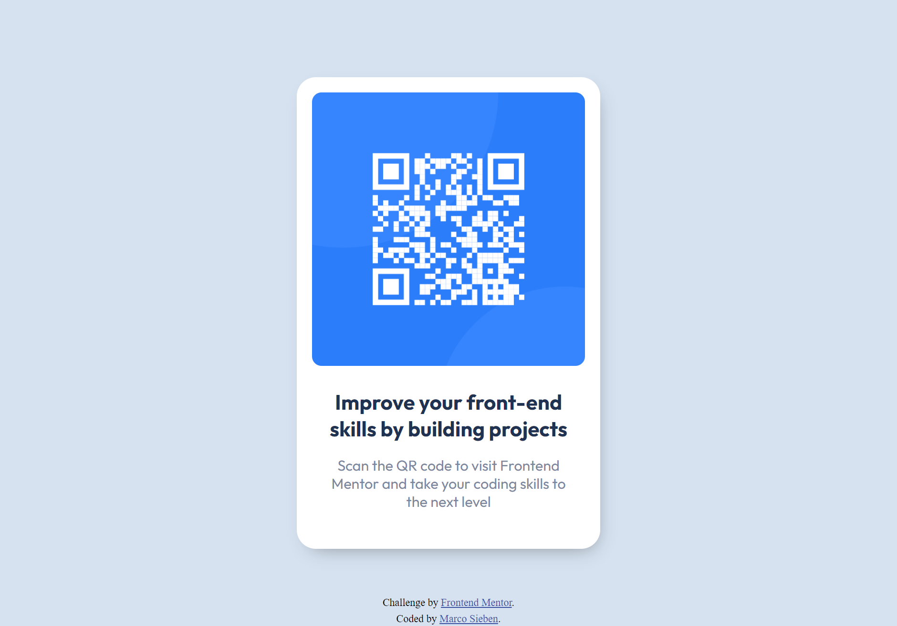

# QR code component solution | Frontend Mentor

This is a solution to the [QR code component challenge on Frontend Mentor](https://www.frontendmentor.io/challenges/qr-code-component-iux_sIO_H).

## Table of contents

- [Overview](#overview)
  - [Screenshot](#screenshot)
  - [Links](#links)
- [My process](#my-process)
  - [Built with](#built-with)
  - [What I learned](#what-i-learned)
  - [Continued development](#continued-development)
  - [Useful resources](#useful-resources)
- [Author](#author)

## Overview

### Screenshot

### Links

- Solution URL: https://github.com/sieben-marco/qr-code-component-main
- Live Site URL: https://sieben-marco.github.io/qr-code-component-main/

## My process

### Built with

- CSS custom properties
- Mobile-first workflow
- Flexbox
- Media Queries
- [BEM](https://en.bem.info/methodology/quick-start/) - Block, Element, Modifier

### What I learned

I learned about BEM and Media Queries. I also applied some things that I've learned about layout designs and how to use display Flexbox and box-shadow.

### Continued development

I want to improve my js and learn some framework.

### Useful resources

- [Box shadow](https://developer.mozilla.org/pt-BR/docs/Web/CSS/box-shadow) - This helped me remember about box-shadow.

## Author

- Frontend Mentor - [@sieben-marco](https://www.frontendmentor.io/profile/sieben-marco)
- LinkedIn - [Marco Sieben](https://www.linkedin.com/in/sieben-marco/)
